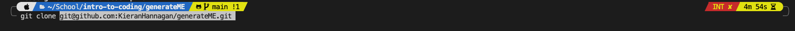

# This is title
          
  ## Description
  This web application allows the user to conveniently and efficiently create a professional README.md file for their project. It will prompt you on the command line a series of questions, returning your answers to a README file that it will generate. It will completely format the file for you and even include a table of Contents.
  
  * [Installation](#installation)
  * [Usage](#usage)
  * [License](#license)
  * [Test](#tests)
  * [Contributing](#contributing)
  * [Questions](#questions)
  * [GitHub](#github)
  * [Email](#email)
  
  ## Installation 
  Clone the repo in your terminal using shell and navigate to your newly cloned directory. You will then want to open the file in your preferred coding software.
  
  ## Usage 
This application uses the Node.js dependency “Inquirer” to retrieve user data via the command line.  To initiate the prompt, navigate to   the directory on the command line, then simply type the “ node index.js ” command into the terminal. It will then ask you a series of questions, after completing the survey it will display 'Success! Your README.md has been generated.'
  
  ## License
  ### Badges
     
  ### Links to licenses
  https://opensource.org/licenses/MIT, https://www.boost.org/LICENSE_1_0.txt, https://opensource.org/licenses/EPL-1.0, https://opensource.org/licenses/Artistic-2.0

  ## Tests 
  Just try it, if it works it works
  
  ## Contributing
  These are some guidelines

  ## Questions
  If you have any questions, feel free to reach out and contact me via email.
  ### Email
  kieranhan1999@gmail.com
  ### GitHub
  www.github.com/KieranHannagan
  

  